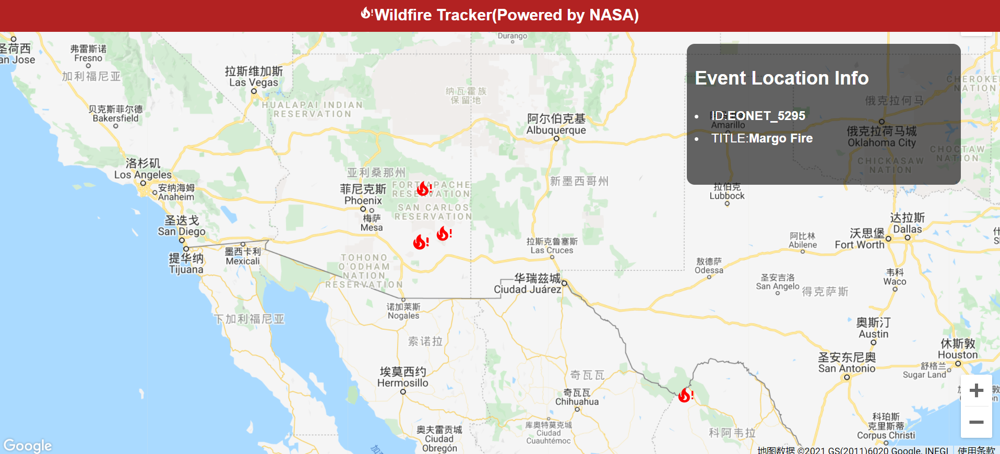

# Wildfire Tracker with React

This project was bootstrapped with [Create React App](https://github.com/facebook/create-react-app).

Note: You should have a Google Cloud Platform account before.

## Set up

### Resources:

- [NASA Event Track API](https://eonet.sci.gsfc.nasa.gov/api/v2.1/events)
- [Google Cloud Platform](https://console.cloud.google.com/apis/credentials/)
- [Google Map](https://www.google.com/maps) - find target latitude and longitude
- [Loading Icon](https://loading.io/spinner/spinner/-spinner-preloader-ajax-loading-icon)

### Scripts:

```bash
npx create-react-app .
npm i google-map-react @iconify/react @iconify/icons-mdi
npm start
```

## Study Notes

### Keywords

- Create Google-Map-React component
- Import fire-alert icon
- Click and show info box

[中文版详细笔记](notes.md)



